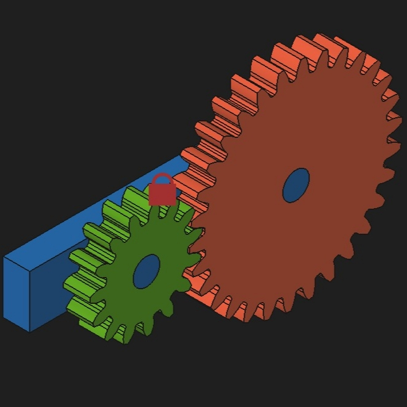

# Project: Parametric Spur Gear Assembly ⚙️

## 📌 Project Overview
This was my first ever attempt at learning CAD software. A foundational mechanical assembly completed during the pre-university self-study phase. This project focuses on modeling a mating pair of spur gears mounted to a common base plate, exploring parametric gear tooth profiles, center-distance alignment, and rotational assembly constraints.

* **Part Number:** `ITS-ME-01-001`
* **Software Used:** FreeCAD
* **Objective:** Design and assemble a functional reduction gear pair with proper tooth meshing.

## 📸 Component Preview

## 🛠️ Design Competencies
* Parametric gear tooth profile generation (Involute geometry).
* Assembly constraint mapping (axial alignment and gear meshing).
* Multi-body part interaction and interference check prevention.
* Universal data exchange optimization via `.step` format export.

---
*Status: Completed (Self-Study Archive)*
